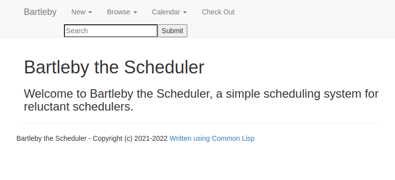
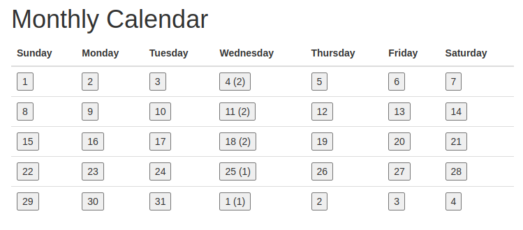
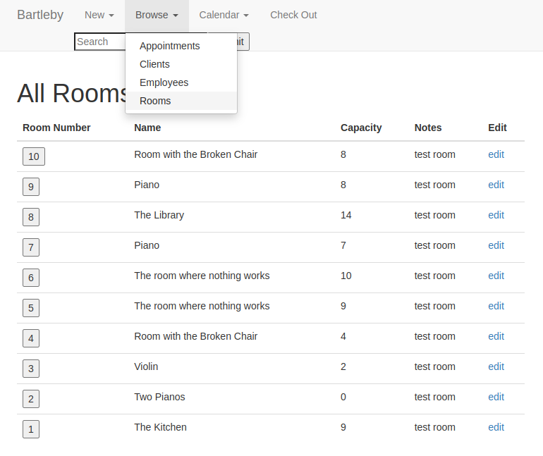

# Bartleby (the Scheduler)

A simple scheduling system for reluctant schedulers, scrivened in Common Lisp

## Running in the REPL

### Getting Set Up
Before running the first time, set up a postgresql database with a login, and add the login information to ```#'bartleby-connect``` in sql.lisp. 

Then, in the repl, run ```(ql:quickload :bartleby)```.
The database connection should automatically start up on quickload, but it might be necessary to run ```(bartleby-connect)``` if you start getting mito errors.

Note: Currently using SBCL and postgresql, hasn't been tested with other Lisp implementations or sqls.


### Test Populations
If you want to give it a try but don't have your own data to use, clients, employees, and rooms can be generated before starting the interface by using ```(generate-clients n)```, ```(generate-employees n)```, or ```(generate-rooms n)```, respectively. 

## Web GUI

Package ```:WEBBARTLEBY``` provides a web-gui application for handling many Bartleby operations:



To start from the REPL: 

```(ql:quickload :webbartleby)```

```(webbartleby:launch)```

This should start the webbartleby server and open your browser to 127.0.0.1:4242.

Example Screens:



Browse rooms (or clients, employees, or appointments)



You will need to follow the database steps listed above for full usability.

## Running with Docker (pre-beta)

Currently, to load with docker, first run ```make``` in the directory, then run ```docker build -t bartleby .```, and finally ```docker run -d -i -p 4242:4242 bartleby```.
If you go to your browser, bartleby should be running at 127.0.0.1:4242, though it will just show the landing page, I'll be connecting it to a separate postgres container next.
